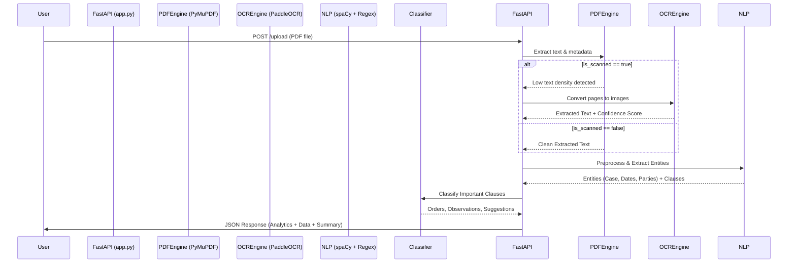

# NyayaMitra Phase 2 Architecture

## System Workflow

## Core Modules Interaction

1. **`app.py`**: The central orchestrator. Handles security (size/MIME limits), initializes endpoints, manages the caching layer for exports (`/export/{id}`), and acts as the entry point for the "Demo Mode".
2. **`extract_pdf.py`**: Fast parser. Analyzes document structure to determine if OCR fallback is mandatory.
3. **`ocr.py`**: Multilingual OCR Engine (`en`, `hi`, `ch`). Processes images using PaddleOCR with optimized zooming for better clarity.
4. **`extractor.py`**: The NLP heart. Combines strict Regex heuristics (for predictable legal patterns like deadlines and case numbers) with `spaCy` NER for fuzzier entity extraction (Parties). Returns data wrapped in Confidence Scores.
5. **`classifier.py`**: Categorizes text spans. Calculates scores based on linguistic markers (e.g., "directed", "shall" -> Orders).
6. **`summary.py`**: Extractive text summarization. Generates 3-5 high-impact bullet points.
7. **`errors.py`**: Standardized exception handling for clean API error responses.
